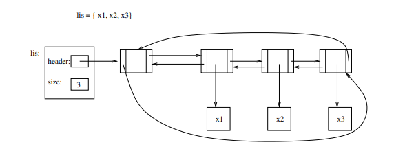
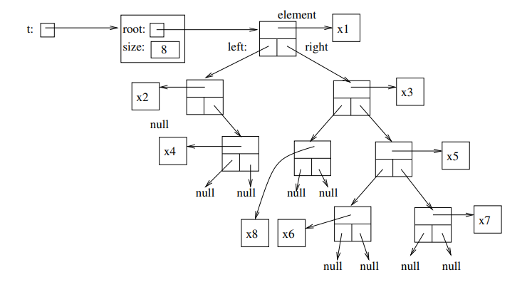
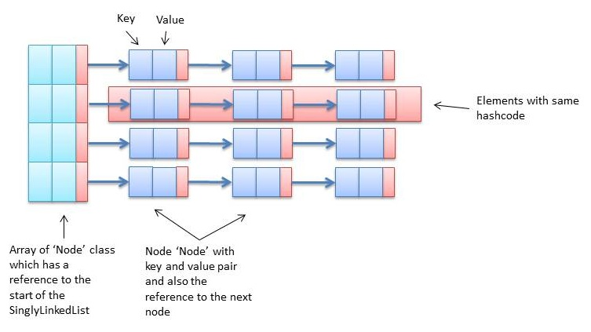

# Cool data structures

## Doubly Linked List

A doubly linked list implemented with Rust, it use [Reference counters](https://doc.rust-lang.org/stable/book/ch15-04-rc.html) and [Reference cells](https://doc.rust-lang.org/stable/book/ch15-05-interior-mutability.html) together to let multiple nodes own a node and modify it

## Sorted Binary Tree

A simple binary Tree which stores its elements in an ordered way.
It implements the 3 most common traversals for binary trees: Inorder, postorder and preorder.

## Hash Set

A Hash Set implemented as a Hash Map (A list of buckets where each bucket owns a Linked List with values)

    This is diagram does not represent a HashSet but a HashMap

